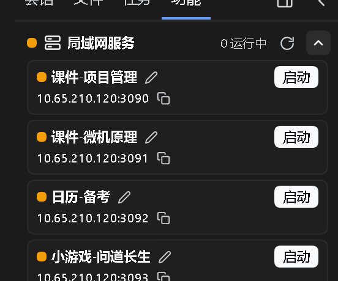

> A vk-free build lives on the [https://github.com/Ln1m/dsh-lan-services/tree/official](https://github.com/Ln1m/dsh-lan-services/tree/official); main is the dual-path version (official slots without vk-suite, vk layout seats with it).

# dsh-lan-services

[中文](README.md) · English



*Screenshot of a running DSH instance; demo content is sanitized.*

A local network service manager: it probes local HTTP services on ports 3090–3099, lists their titles and LAN URLs in a sidebar panel, starts/stops the processes with one click, and updates the URLs when the network changes.

## Install

```sh
dsh plugin --profile web add file:<this repo>
```

## Site list

`servers/sites.json`, keyed by port:

```json
{
  "3090": { "title": "Demo site", "root": "D:\\sites\\demo", "index": "index.html" }
}
```

## Requirements

- Windows
- Phone access goes through the 3081 reverse proxy, which is a separate concern (dsh-wifi-access / dsh-pocket)

## Slots reserved for LAN / public links

This plugin uses official sidebar slots, does not depend on the three-column layout, and does not occupy the two slots below. If you also run `dsh-vk-suite`, they are reserved for link-style plugins:

| Reserved slot | Intended for |
|---|---|
| `vk.statusbar.left` | LAN links: local LAN access URLs, local service lists |
| `vk.statusbar.right` | Public links: tunnels / reverse proxies / share URLs |

Whoever implements it claims it, via `vkCard` — see the dsh-vk-suite README.
