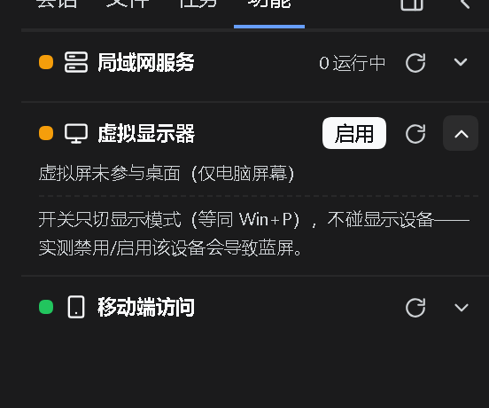

# dsh-extensions-panel

> Two builds: `main` is the **vk build** (vk slots only — install the [dsh-vk-suite](https://github.com/Ln1m/dsh-vk-suite) contract + skeleton first); the `official` branch is the **vk-free build** (no vk dependency, official slots only). **Use the vk build** — position: one card inside the sidebar Tools tab (`vk.sidebar.extensions`).
> Conflicts: a slot renders only its highest-priority entry, and two registrations at the same priority throw; mutually exclusive with anything claiming the same position (see "How to use it / what it conflicts with" in [dsh-vk-suite](https://github.com/Ln1m/dsh-vk-suite)).

[中文](README.md) · English



*Screenshot of a running DSH instance; demo content is sanitized.*

Registers a virtual-display toggle card inside the vk layout's left-column "Extensions" tab (`vk.sidebar.extensions`).

## Install

```sh
dsh plugin --profile web add file:<this repo>
```

Restart the web instance afterwards.
